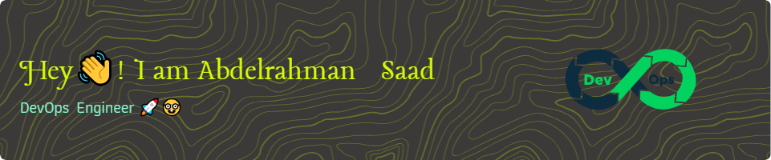

# This is Abdelrahman Saad, or you can call me Abdo 😄
please find me in the social links below 😅

)

Hello 👋

## Want to know about me ? ⚽👦

An enthusiastic developer who is consistantly looking for new challenges. I am also a Computer Science nerdy 🤓. I am super ambitious to unlock my potential and acheive more in live.
I want to know all about software development and how to enhance it by the experience i will be gaining as a software engineer.

I am interested in the following areas 

- [x] 📱 Cross-platform mobile development using Flutter
- [x] 🔄 Pipelining using Jenkins and Ansible
- [x] 📜 Scripting using Bash (and GoLang soon)
- [x] ☁️ Deploying projects to cloup provider (AWS mostly)
- [X] 🏗️ Terraform coding for to create IaC
- [X] 🛠️ Maintinacne of software projects
- [x] 📦 Docker and Kubernates
- [x] :octocat: Manage projects via Git
- [x] 🖥️ Monitoring using Prometheus 

## 🐙 Skills

Programing Skills

 

Soft Skills

 
  

